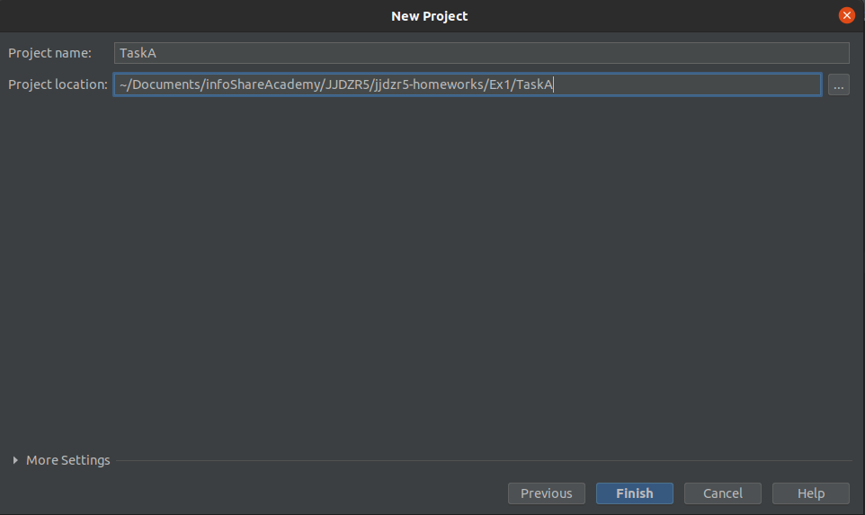

# Zadanie 1 - Podstawy programowania Java SE

### Zadanie A (2 pkt) :abcd:
Napisz prosty program z jedną metodą (oprócz metody main), która przyjmuje parametr typu _String_ i zwraca typ _char_.  
W utworzonej metodzie pobieramy pierwszą literę napisu z parametru i zwracamy ją (jako typ char).  
W metodzie main() skorzystaj z tej utworzonej metody i wypisz na konsolę wynik w postaci: `parametr - pierwszaLitera`  

np.<br/>
```
Adam - A
rower - r
1 Sprint - 1
```

Przetestuj działanie metody dla kilku przykładowych wartości parametru.  
<br/>

### Zadanie B (3 pkt) :1234:
Stwórz prosty kalkulator, który pobiera dwie dowolne liczby i wykonuje na nich podstawowe działania (dodawanie, odejmowanie, mnożenie, dzielenie). <br/>
Operacje powinny być wykonywane za pomocą odpowiednich metod statycznych, np.: `Calculator.add(2, 5)`  
Kalkulator powinien wyświetlić poprawny wynik dla podanych parametrów, np.:
```
12 - 4 = 8
12 / 4 = 3
```

Przetestuj działanie swojego kalkulatora dla różnych operacji matematycznych.    


---

## Forma oddania zadania
Zadanie powinno być oddane w formie commitów na oddzielnym branchu o nazwie w konwecji `nrzadania_ImięNazwisko` (np: `1_LukaszChrzanowski`)

Jako że to początek przygody z gitem, przejdźmy razem przez wszystkie kroki, które musisz wykonać.

## :building_construction: 
1. Przejdź w konsoli do miejsca, gdzie chcesz mieć repozytorium.
2. Sklonuj repozytorium wykonując: `git clone https://github.com/infoshareacademy/jjdzr5-homeworks.git`
3. Stwórz branch o dobrej nazwie, np.: `1_LukaszChrzanowski` poprzez: 
```
git checkout -b 1_TwojeImięNazwisko
```
4. Upewnij się, że poprawnie założyłeś/aś branch: 
```
git status
```
Tekst w konsoli powinien głosić: `On branch 1_TwojeImięNazwisko`

5. Uruchom IntelliJ i utwórz nowy projekt do każdego zadania (np. TaskA, TaskB).  
Jeśli nie wiesz jak to zrobić, to pomoże w tym ta instrukcja: https://www.jetbrains.com/help/idea/creating-and-running-your-first-java-application.html  
:exclamation: Zwróć uwagę, żeby odpowiednio ustawić ścieżkę do projektu (Project location) - musi się on znaleźć w katalogu `Ex1` w sklonowanym wczesniej repozytorium `jjdzr5-homeworks`. To jest bardzo ważne, bo w przeciwnym razie Twoje rozwiązanie nie trafi do zdalnego repo na GitHubie. Tak więc, tworząc projekt pod zadanie, sprawdź dokładnie, czy 'Project location' kończy się taką ścieżką: `(jakieś lokalizacja w komputerze)/jjdzr5-homeworks/Ex1/TaskA`.  
  

6. Wykonaj zadanie i commituj wyniki. Aby wykonać commit, najprościej:
```
git add -A
git commit -m "this is my commit message"
```
8. Wyślij zmiany na GitHub'a poprzez push: 
```
git push origin 1_TwojeImięNazwisko
```
9. Twój branch ze wszystkimi commitami powinien znajdować się na GitHub'ie, upewnij się tutaj: https://github.com/infoshareacademy/jjdzr5-homeworks/branches
10. Chcesz dodać kolejne zmiany? commit i push ... i tak aż do ukończenia zadania :tada:
11. W razie potrzeby — łap mnie na Slacku :calling:


## Punktacja

Do zdobycia jest :five: pkt.
Zadania oddane po terminie są oceniane na maksymalnie połowę punktów.

#### Powodzenia!

### :clock12: Termin oddania:
## Poniedziałek, 07.02.2022

